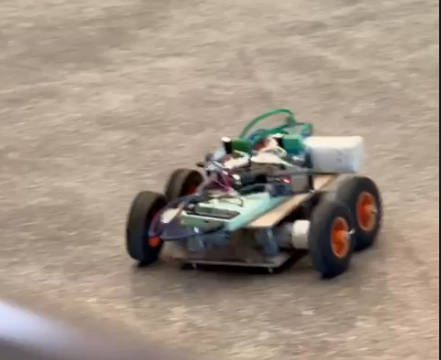
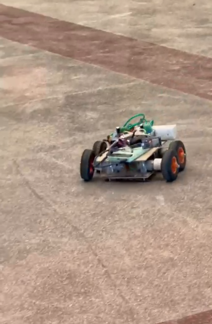

# Wireless RC Car Using ESP32

A self-initiated hardware project developed to explore embedded systems, wireless RC control, PWM-based motor control, power electronics, voltage regulation, and practical hardware debugging.

---

## 📌 Project Overview

This project is a wireless RC car controlled using an ESP32 and a FlySky FS-iA6B receiver.

The RC transmitter sends control commands wirelessly to the FS-iA6B receiver. The receiver passes the control signals to the ESP32, which processes the inputs and generates PWM signals for BTS7960 motor drivers.

A 3S LiPo battery is used as the primary power source, while LM2596 buck converters are used for voltage regulation of the low-voltage electronics.

The project was independently designed, assembled, tested, and debugged to gain practical experience with embedded hardware and power electronics.

---

## 🎯 Objectives

- Build a wireless RC-controlled vehicle
- Interface an RC receiver with an ESP32
- Implement PWM-based DC motor control
- Interface BTS7960 high-current motor drivers
- Understand DC-DC buck conversion
- Work with a LiPo battery-powered system
- Learn practical power distribution and grounding
- Develop hardware troubleshooting skills
- Understand thermal considerations in motor-drive systems

---

## ⚙️ Features

- Wireless RC control
- ESP32-based control system
- FlySky FS-iA6B receiver
- BTS7960 motor drivers
- PWM-based motor control
- 3S LiPo battery power
- LM2596 buck-converter-based voltage regulation
- Differential motor control
- Practical hardware debugging and testing

---

## 🏗️ System Architecture

```text
                    RC TRANSMITTER
                          |
                    Wireless Signal
                          |
                          v
                   FS-iA6B RECEIVER
                          |
                     CH1 / CH2
                          |
                          v
                       ESP32
                          |
                    PWM Signals
                          |
              +-----------+-----------+
              |                       |
              v                       v
        BTS7960 #1              BTS7960 #2
              |                       |
              v                       v
        Left Motor(s)            Right Motor(s)
````

---

## 🔋 Power Architecture

The vehicle is powered by a 3S LiPo battery.

```text
                 3S LiPo Battery
               11.1V nominal
               12.6V fully charged
                       |
          +------------+------------+
          |                         |
          v                         v
   BTS7960 Drivers            LM2596 Buck
          |                         |
          v                         v
      DC Motors              Regulated Supply
                                      |
                              +-------+-------+
                              |               |
                              v               v
                            ESP32         FS-iA6B
```

The motor-drive system receives power from the main battery, while the buck converter provides regulated voltage for the control electronics.

---

## 🧰 Hardware Components

| Component              |    Quantity | Purpose                    |
| ---------------------- | ----------: | -------------------------- |
| ESP32                  |           1 | Main microcontroller       |
| FlySky FS-iA6B         |           1 | RC signal receiver         |
| RC Transmitter         |           1 | Wireless control           |
| BTS7960                |           2 | High-current motor drivers |
| DC Motors              |     As used | Vehicle propulsion         |
| LM2596 Buck Converter  |           2 | Voltage regulation         |
| 3S LiPo Battery        |           1 | Main power source          |
| 100 µF Capacitor       |           1 | Power filtering            |
| 22 µF Capacitor        |           1 | Power filtering            |
| Motor Driver Heatsinks |           2 | Thermal management         |
| Chassis & Wheels       |       1 set | Mechanical structure       |
| Connecting Wires       | As required | Electrical connections     |

---

## 🎮 Control System

The control sequence is:

```text
RC Transmitter
      ↓
Wireless Communication
      ↓
FS-iA6B Receiver
      ↓
ESP32
      ↓
Input Processing
      ↓
PWM Generation
      ↓
BTS7960 Motor Drivers
      ↓
DC Motors
```

The receiver provides throttle and steering information to the ESP32.

The ESP32 processes these inputs and generates PWM signals for the motor drivers.

---

## ⚡ Motor Control

The BTS7960 modules provide the interface between the ESP32 and the DC motors.

The ESP32 controls the motor drivers using PWM signals.

The basic concept is:

```text
RC Input
   ↓
ESP32
   ↓
PWM
   ↓
BTS7960
   ↓
DC Motor
```

PWM duty cycle is used to control the motor drive level.

The direction of the motor is controlled using the RPWM and LPWM inputs of the BTS7960.

---

## 🔌 Pin Configuration

### FS-iA6B → ESP32

| Receiver | ESP32   | Function |
| -------- | ------- | -------- |
| CH1      | GPIO 34 | Throttle |
| CH2      | GPIO 35 | Steering |

### BTS7960 #1 → ESP32

| BTS7960 | ESP32   | Function  |
| ------- | ------- | --------- |
| RPWM    | GPIO 25 | Motor PWM |
| LPWM    | GPIO 26 | Motor PWM |

### BTS7960 #2 → ESP32

| BTS7960 | ESP32   | Function  |
| ------- | ------- | --------- |
| RPWM    | GPIO 27 | Motor PWM |
| LPWM    | GPIO 14 | Motor PWM |

> Pin assignments should be verified against the final physical wiring before operating the vehicle.

---

## 🔧 Differential Drive

The vehicle uses differential motor control for steering.

```text
Forward:
Left  → Forward
Right → Forward

Reverse:
Left  → Reverse
Right → Reverse

Turning:
Left and right motor speeds
are varied relative to each other.
```

This allows the vehicle to turn without requiring a separate steering servo.

---

## 🧪 Hardware Debugging

An important part of this project was troubleshooting real hardware problems during development.

### Unexpected Motor Movement

At one stage, the motors moved when the LiPo battery was connected even without the expected receiver control.

Possible areas investigated included:

* PWM input states
* Enable pins
* Ground connections
* Motor-driver wiring
* Power distribution
* Floating control inputs

This highlighted the importance of defining safe startup states in motor-control systems.

---

### ESP32 Power Problems

The ESP32 was tested using USB power as well as regulated power from an LM2596 buck converter.

The board exhibited abnormal heating during testing.

Voltage measurements and isolation tests were used while investigating the problem.

This reinforced the importance of:

* Checking supply voltage
* Checking polarity
* Proper grounding
* Measuring power rails before connecting components
* Avoiding repeated powering of potentially damaged hardware

---

### LM2596 Buck Converter Failure

An LM2596 module was damaged during development.

This provided practical experience with the risks involved in battery-powered power electronics.

The incident reinforced the importance of:

* Checking input voltage
* Checking output voltage
* Checking polarity
* Avoiding accidental shorts
* Testing power supplies before connecting sensitive electronics

---

### Receiver Communication

The FS-iA6B receiver was tested for communication with the RC transmitter.

Receiver power, binding, and channel signals were investigated during development.

This demonstrated that powering a receiver does not necessarily mean that valid transmitter-receiver communication has been established.

---

## 🌡️ Thermal Management

The BTS7960 motor drivers can generate heat while driving motors, particularly under higher loads.

Heatsinks were added to the motor-driver modules as part of the thermal-management approach.

Thermal behavior depends on factors such as:

* Motor current
* Mechanical load
* Operating time
* Driver losses
* Battery voltage

---

## 🔋 Power Filtering

The project includes:

* 100 µF capacitor
* 22 µF capacitor

These capacitors were considered for power-supply filtering and helping reduce supply fluctuations.

---

## 🧪 Testing Approach

The system was developed incrementally rather than connecting everything simultaneously.

```text
Check Battery Voltage
        ↓
Check Buck Converter Output
        ↓
Check Receiver Power
        ↓
Check Receiver Communication
        ↓
Check ESP32 Power
        ↓
Check Receiver Signals
        ↓
Test Motor Driver
        ↓
Test Motor
        ↓
Integrate Complete System
```

This approach helps isolate faults and reduces the risk of damaging multiple components during troubleshooting.

---

## 📚 Learning Outcomes

### Power Electronics

* DC-DC buck conversion
* Voltage regulation
* Power distribution
* Supply filtering
* LiPo battery systems
* Thermal management

### Embedded Systems

* ESP32
* GPIO
* PWM
* RC receiver interfacing
* Embedded C/C++

### Motor Control

* DC motor control
* BTS7960 motor drivers
* Direction control
* PWM speed control
* Differential drive

### Hardware Debugging

* Multimeter-based testing
* Voltage measurements
* Grounding issues
* Power-supply troubleshooting
* Fault isolation
* Thermal troubleshooting

---

## 🚧 Challenges

The main challenges encountered during development included:

1. Establishing reliable power distribution.
2. Understanding the interaction between the ESP32, receiver, and motor drivers.
3. Preventing unintended motor activation.
4. Troubleshooting receiver communication.
5. Investigating abnormal ESP32 heating.
6. Dealing with failure of an LM2596 module.
7. Managing motor-driver heat.
8. Ensuring reliable grounding and signal connections.

---

## 🚀 Future Improvements

Possible future improvements include:

* Battery voltage monitoring
* Motor current sensing
* Improved power filtering
* Dedicated PCB design
* Improved thermal management
* Motor feedback
* Closed-loop speed control
* Wireless telemetry
* Battery monitoring and protection
* Emergency motor shutdown
* Improved mechanical design

---

## 📷 Project Gallery

### RC Car



### RC Car — Additional View



---

## 🔌 Wiring Diagram

The hardware architecture and major electrical connections are documented in:

**[View the Wiring Diagram](hardware/wiring_diagram.png)**

For detailed pin assignments:

**[View Hardware Pinout](hardware/pinout.md)**

---

## 📁 Repository Structure

```text
ESP32-Wireless-RC-Car/
│
├── README.md
├── LICENSE
├── .gitignore
│
├── rc_car.png
├── rc_car_2.png
│
├── src/
│   └── rc_car.ino
│
├── hardware/
│   ├── pinout.md
│   └── wiring_diagram.png
│
└── documentation/
    ├── components.md
    └── project_report.md
```

---

## 🎥 Project Demo

A demonstration video of the RC car is available separately.

> Video link will be added after uploading the demonstration video.

---

## 👤 Project Information

**Project Type:** Individual / Self-Initiated

**Primary Areas:**

* Power Electronics
* Embedded Systems
* Motor Control
* Electric Vehicle Systems
* Hardware Prototyping

---

## 📌 Key Skills Demonstrated

```text
ESP32
Embedded C/C++
PWM Motor Control
RC Receiver Interfacing
BTS7960 Motor Drivers
LM2596 Buck Converters
LiPo Battery Systems
DC Motor Control
Voltage Regulation
Power Distribution
Circuit Debugging
Multimeter Testing
Thermal Management
Hardware Prototyping
```

---

## 📄 License

This project is licensed under the MIT License.

````


**Send me a screenshot of how the README looks after you commit it.** I'll check whether the images, wiring link, formatting, and repository structure are all working before we move on.
